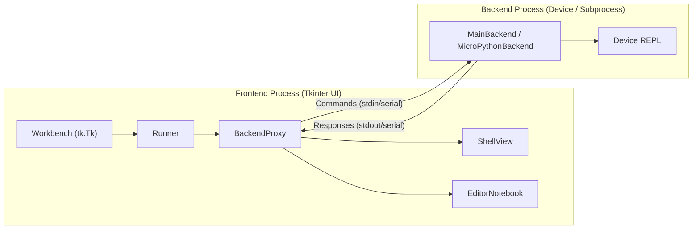
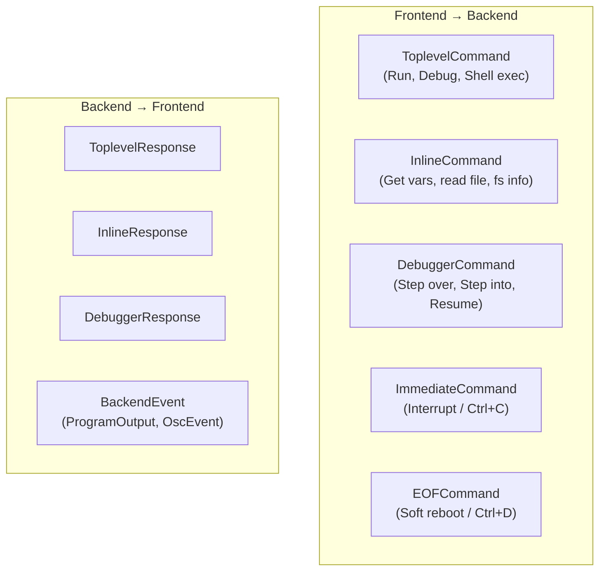

# Thonny IDE — Complete Technical Spec Sheet

> **Purpose**: This document maps every building block of the Thonny IDE so we can extract, replicate, and automate its capabilities into a headless CLI-driven tool for ESP32 (and similar) device management on macOS.

> [!IMPORTANT]
> This spec sheet was generated by 4 parallel research agents that read **every file** across the Thonny codebase. It serves as the foundation for our automation project.

---

## Table of Contents

1. [Project Identity](#1-project-identity)
2. [Core Architecture](#2-core-architecture)
3. [Plugin System](#3-plugin-system)
4. [USB / Serial Port Detection](#4-usb--serial-port-detection)
5. [Firmware Flashing](#5-firmware-flashing)
6. [Backend Communication Protocol](#6-backend-communication-protocol)
7. [File Transfer (Device ↔ Host)](#7-file-transfer-device--host)
8. [Shell / REPL System](#8-shell--repl-system)
9. [Editor & Code Intelligence](#9-editor--code-intelligence)
10. [Package Management](#10-package-management)
11. [LLM / AI Integration](#11-llm--ai-integration)
12. [Configuration System](#12-configuration-system)
13. [Build, Packaging & Dependencies](#13-build-packaging--dependencies)
14. [Error Handling & Recovery](#14-error-handling--recovery)
15. [Device-Specific Quirks](#15-device-specific-quirks)
16. [Automation Extraction Map](#16-automation-extraction-map)

---

## 1. Project Identity

| Field | Value |
|---|---|
| **Name** | Thonny |
| **Version** | `6.0.0.dev1` |
| **License** | MIT |
| **Python Requirement** | `>=3.11` (supports 3.11–3.15) |
| **Build Backend** | `uv_build >=0.11.6, <0.12.0` |
| **Entry Point** | `thonny = "thonny:launch"` (gui-scripts) |
| **Source** | [thonny-master/](file:///Users/mindflow/Projects/Blink/thonny-master/) |

### Key Source Files

| File | Size | Purpose |
|---|---|---|
| [workbench.py](file:///Users/mindflow/Projects/Blink/thonny-master/thonny/workbench.py) | 124KB | IDE heart — UI, plugins, events, layout |
| [shell.py](file:///Users/mindflow/Projects/Blink/thonny-master/thonny/shell.py) | 88KB | REPL / Shell console |
| [running.py](file:///Users/mindflow/Projects/Blink/thonny-master/thonny/running.py) | 70KB | Execution engine, Runner, BackendProxy |
| [base_file_browser.py](file:///Users/mindflow/Projects/Blink/thonny-master/thonny/base_file_browser.py) | 66KB | File browser (local + remote) |
| [editors.py](file:///Users/mindflow/Projects/Blink/thonny-master/thonny/editors.py) | 55KB | Editor tabs, save states, LSP sync |
| [backend.py](file:///Users/mindflow/Projects/Blink/thonny-master/thonny/backend.py) | 30KB | Backend process abstraction |
| [common.py](file:///Users/mindflow/Projects/Blink/thonny-master/thonny/common.py) | 27KB | Shared types: Commands, Responses, Records |

---

## 2. Core Architecture

### Frontend-Backend Separation

Thonny uses a strict **two-process architecture**:



### Key Classes & Their Roles

| Class | File | Role |
|---|---|---|
| **`Workbench`** | [workbench.py](file:///Users/mindflow/Projects/Blink/thonny-master/thonny/workbench.py) | Central hub. Inherits `tk.Tk`. Manages plugins, config, themes, UI layout, global event loop |
| **`Runner`** | [running.py](file:///Users/mindflow/Projects/Blink/thonny-master/thonny/running.py) | Execution orchestrator. Maintains state, queues commands, owns the BackendProxy |
| **`BackendProxy`** | [running.py](file:///Users/mindflow/Projects/Blink/thonny-master/thonny/running.py) | Frontend-side abstraction of backend channel (subprocess, serial, SSH) |
| **`SubprocessProxy`** | [running.py](file:///Users/mindflow/Projects/Blink/thonny-master/thonny/running.py) | Concrete proxy for local CPython subprocess backends |
| **`BareMetalMicroPythonProxy`** | [mp_front.py](file:///Users/mindflow/Projects/Blink/thonny-master/thonny/plugins/micropython/mp_front.py) | Frontend proxy for serial-connected MicroPython devices |
| **`MicroPythonBackend`** | [mp_back.py](file:///Users/mindflow/Projects/Blink/thonny-master/thonny/plugins/micropython/mp_back.py) | Backend-side REPL handler, code execution, object inspection |
| **`BareMetalMicroPythonBackend`** | [bare_metal_backend.py](file:///Users/mindflow/Projects/Blink/thonny-master/thonny/plugins/micropython/bare_metal_backend.py) | Serial/WebREPL connection manager, raw paste mode, soft reboots |
| **`BaseBackend` / `MainBackend`** | [backend.py](file:///Users/mindflow/Projects/Blink/thonny-master/thonny/backend.py) | Backend read-loop, command consumption, stdout/stderr routing |
| **`ShellView`** | [shell.py](file:///Users/mindflow/Projects/Blink/thonny-master/thonny/shell.py) | Interactive console, magic commands, IO display |

### Boot Sequence

```
thonny/main.py → parse args → single-instance check
    → Workbench.__init__()
        → UI scaling, logging, theme engine
        → Core services (ShellView, Runner)
        → _load_plugins() → scan thonny.plugins + thonnycontrib
            → Each plugin's load_plugin() registers backends, views, commands
        → Menus, toolbars, fonts, layouts rendered
    → tk.Tk.mainloop()
```

---

## 3. Plugin System

### How It Works

| Aspect | Implementation |
|---|---|
| **Discovery** | Scans `thonny.plugins` (built-in) and `thonnycontrib` (external) namespaces |
| **Loading** | Executes each module's `load_plugin()` function at startup |
| **Registration API** | Plugins call methods on `get_workbench()`: |
| | `add_view()` — new UI panes |
| | `add_command()` — menu items, toolbar buttons, keyboard shortcuts |
| | `add_backend()` — new execution environments |
| **Event System** | PubSub via `get_workbench().bind(event, handler)` and `event_generate(event)` |
| **Key Events** | `WorkbenchReady`, `BackendTerminated`, `ToplevelResponse`, `ThemeChanged` |

### Plugin Directories (Hardware-Related)

| Directory | Purpose | Key Files |
|---|---|---|
| [esp/](file:///Users/mindflow/Projects/Blink/thonny-master/thonny/plugins/esp/) | ESP32/ESP8266 support | `__init__.py` (proxies, config), `esp32_back.py`, `esp8266_back.py` |
| [micropython/](file:///Users/mindflow/Projects/Blink/thonny-master/thonny/plugins/micropython/) | Generic MicroPython backend | `mp_front.py`, `mp_back.py`, `bare_metal_backend.py`, `esptool_dialog.py` |
| [circuitpython/](file:///Users/mindflow/Projects/Blink/thonny-master/thonny/plugins/circuitpython/) | CircuitPython support | `__init__.py` (VID/PID overrides, UF2 flashing) |
| [rp2040/](file:///Users/mindflow/Projects/Blink/thonny-master/thonny/plugins/rp2040/) | RP2040 chip support | `__init__.py` |
| [rpi_pico/](file:///Users/mindflow/Projects/Blink/thonny-master/thonny/plugins/rpi_pico/) | Raspberry Pi Pico | `__init__.py` (VID `0x2E8A`, PID `0x0005`) |

---

## 4. USB / Serial Port Detection

> [!IMPORTANT]
> This is the most critical block for our automation project. Thonny's port detection is the foundation of "plug-and-play" device support.

### Detection Logic

Detection is implemented in `BareMetalMicroPythonProxy._is_potential_port(p)`:

```
1. Enumerate all serial ports (pyserial's list_ports)
2. Filter OUT:
   - "CircuitPython CDC2" interfaces (debug/data, not REPL)
3. Filter IN by matching port description/manufacturer strings:
   - "USB", "UART", "DAPLink", "STLink", "MicroPython"
4. Apply device-specific VID/PID filters (see table below)
5. Cache successful port → VID/PID mappings for auto-reconnect
```

### Vendor ID / Product ID Database

| Device Family | Vendor ID (VID) | Product ID (PID) | Chip | Source File |
|---|---|---|---|---|
| **Espressif Native USB** | `0x303A` | various | ESP32-S2/S3/C3 | [esp/__init__.py](file:///Users/mindflow/Projects/Blink/thonny-master/thonny/plugins/esp/__init__.py) |
| **Silicon Labs CP210x** | `0x10C4` | `0xEA60` | CP2102/CP2104 | pyserial defaults |
| **WCH CH340** | `0x1A86` | `0x7523` | CH340G/CH341 | pyserial defaults |
| **FTDI** | `0x0403` | various | FT232R/FT2232 | pyserial defaults |
| **Raspberry Pi Pico** | `0x2E8A` | `0x0005` | RP2040 | [rpi_pico/__init__.py](file:///Users/mindflow/Projects/Blink/thonny-master/thonny/plugins/rpi_pico/__init__.py) |

### Text-Based Matching (ESP32)

Beyond VID/PID, the ESP plugin also text-matches on port description strings:
- ✅ Match: `"m5stack"`, `"esp32"` in description
- ❌ Exclude: `"circuitpython"` in description

### Port Caching

Successful connections are cached in `serial.last_backend_per_vid_pid` so the correct backend auto-assigns on reconnect.

### macOS Port Patterns

On macOS, ESP32 devices appear as:
- `/dev/cu.usbserial-*` (CP210x, CH340, FTDI)
- `/dev/cu.usbmodem*` (Espressif native USB)

### USB Disk Detection (UF2 Boards)

For boards using UF2 flashing (RP2040, CircuitPython), [udisks.py](file:///Users/mindflow/Projects/Blink/thonny-master/thonny/udisks.py) uses Linux DBus/UDisks2 to detect mounted USB mass storage volumes. On macOS, `adafruit_board_toolkit` is used instead.

---

## 5. Firmware Flashing

### ESP32 — esptool Integration

Implemented in [esptool_dialog.py](file:///Users/mindflow/Projects/Blink/thonny-master/thonny/plugins/micropython/esptool_dialog.py):

| Parameter | Options | Default |
|---|---|---|
| **Baud Rate** | 9600, 57600, 115200, 230400, 460800 | 460800 |
| **Flash Mode** | `dio`, `qio`, `dout`, `qout` | `dio` |
| **Flash Size** | `detect`, `2MB`, `4MB`, `8MB`, `16MB` | `detect` |
| **Erase All** | `--erase-all` flag | Optional |
| **No Stub** | `--no-stub` flag (workaround for boards that fail with stub) | Optional |

### Start Address by Chip Family

> [!WARNING]
> Getting the start address wrong will brick the flash. This mapping is critical.

| Chip | Start Address |
|---|---|
| `esp32` | `0x1000` |
| `esp32s2` | `0x1000` |
| `esp8266` | `0x0` |
| `esp32s3` | `0x0` |
| `esp32c3` | `0x0` |
| `esp32c6` | `0x0` |

### Flashing Command (Equivalent)

```bash
esptool.py --port /dev/cu.usbserial-XXXXX \
           --baud 460800 \
           --chip esp32 \
           write_flash \
           --flash_mode dio \
           --flash_size detect \
           0x1000 firmware.bin
```

### UF2 Flashing (RP2040 / CircuitPython)

For boards that support UF2:
1. Device enters bootloader mode (hold BOOTSEL button)
2. Mounts as USB mass storage drive
3. `.uf2` file is simply **copied** to the mounted volume
4. Device auto-reboots with new firmware

### Firmware Variant Database

Thonny maintains JSON databases for firmware variant discovery:

| File | Purpose |
|---|---|
| [micropython-variants-esptool.json](file:///Users/mindflow/Projects/Blink/thonny-master/data/micropython-variants-esptool.json) | MicroPython ESP variants |
| [micropython-variants-uf2.json](file:///Users/mindflow/Projects/Blink/thonny-master/data/micropython-variants-uf2.json) | MicroPython UF2 variants |
| [circuitpython-variants-esptool.json](file:///Users/mindflow/Projects/Blink/thonny-master/data/circuitpython-variants-esptool.json) | CircuitPython ESP variants |
| [circuitpython-variants-uf2.json](file:///Users/mindflow/Projects/Blink/thonny-master/data/circuitpython-variants-uf2.json) | CircuitPython UF2 variants |
| [circuitpython-variants-daplink.json](file:///Users/mindflow/Projects/Blink/thonny-master/data/circuitpython-variants-daplink.json) | CircuitPython DAPLink variants |

---

## 6. Backend Communication Protocol

### Message Types (defined in [common.py](file:///Users/mindflow/Projects/Blink/thonny-master/thonny/common.py))



### Serialization

| Channel | Mechanism |
|---|---|
| **Local CPython** | `sys.stdin` / `sys.stdout` (line-based JSON) |
| **Serial (ESP32)** | PySerial over `/dev/cu.*` port |
| **WebREPL** | WebSocket (`ws://<ip>:8266`) via `websockets` library |
| **SSH** | `paramiko` SSH tunnel |

### Raw Paste Mode (Critical for ESP32)

To efficiently execute code blocks on MicroPython devices:

```
1. Send \x05 (Ctrl+E) → Enter paste mode
2. Send A\x01 → Request raw paste mode
3. Check for R\x01 (accepted) or R\x00 (refused, fallback to normal paste)
4. Stream code in chunks
5. Send \x04 (Ctrl+D) → Execute
```

### Helper Injection

On connection, Thonny injects `EXTRA_HELPER_CODE` into the REPL, defining a `__minny_helper` class that handles:
- Object inspection and serialization
- Capturing stdout transparently
- Wrapping expressions in `__minny_helper.print_repl_value(...)` for clean rendering

---

## 7. File Transfer (Device ↔ Host)

### Mechanism

| Aspect | Implementation |
|---|---|
| **UI** | Dual-pane file browser: `ActiveLocalFileBrowser` + `ActiveRemoteFileBrowser` |
| **Commands** | `InlineCommand("upload")` / `InlineCommand("download")` |
| **Dialog** | `TransferDialog` (extends `InlineCommandDialog`) with progress indicator |
| **Batch Prep** | `prepare_upload()` / `prepare_download()` resolves metadata, confirms overwrites |
| **Chunk Size** | 127 bytes (default), 64 bytes for RP2040 |
| **Chunk Delay** | Configurable `write_block_delay` to prevent buffer overruns |
| **Newlines** | Auto-normalizes `\r\n` → `\n` for files with `#!` shebangs |

### Filesystem Operations on Device

| Operation | Device-Side Code |
|---|---|
| Get FS info | `os.statvfs("/")` → total/free space |
| List directory | `os.stat()` loop over `os.listdir()` |
| Read file | `open(path, "rb").read()` in chunks |
| Write file | `open(path, "wb").write()` in chunks |
| Delete | `os.remove()` or `os.rmdir()` |

---

## 8. Shell / REPL System

### Features

| Feature | Implementation |
|---|---|
| **Magic Commands** | `%Run`, `%Debug`, `%cd`, `%run`, `%upload` — parsed by `submit_magic_command()` |
| **IO Display** | `ProgramOutput` events rendered inline with tag-based formatting (stdout vs stderr) |
| **Interrupt** | `\x03` (Ctrl+C) sent as `ImmediateCommand("interrupt")` on separate thread |
| **Soft Reboot** | `\x04` (Ctrl+D / EOT) triggers MicroPython soft-reboot |
| **History** | Command history with up/down arrow navigation |
| **Object Links** | Clickable object references in output (linked to Object Inspector) |

---

## 9. Editor & Code Intelligence

### Editor System ([editors.py](file:///Users/mindflow/Projects/Blink/thonny-master/thonny/editors.py))

| Feature | Implementation |
|---|---|
| **Tabs** | `EditorNotebook` (custom `ttk.Notebook`) managing multiple `Editor` instances |
| **Syntax Highlighting** | `CodeView` widget with theme-aware tokenization |
| **Modified State** | Tkinter `edit_modified` flag tracking |
| **Save** | Local: `write_local_file()`. Remote: `InlineCommand("write_file")` |
| **External Changes** | `check_for_external_changes()` compares mtime, prompts reload |

### LSP Integration ([lsp_proxy.py](file:///Users/mindflow/Projects/Blink/thonny-master/thonny/lsp_proxy.py))

| Capability | Protocol |
|---|---|
| Autocomplete | `textDocument/completion` |
| Hover Info | `textDocument/hover` |
| Diagnostics | `textDocument/publishDiagnostics` |
| Go to Definition | `textDocument/definition` |
| Symbols | `textDocument/documentSymbol`, `workspace/symbol` |
| Rename | `textDocument/rename` |
| **Sync** | Debounced `DidChangeTextDocumentParams` on every keystroke |
| **Servers** | BasedPyright (main), Ruff (formatting/linting) |

---

## 10. Package Management

### pip GUI ([pip_gui.py](file:///Users/mindflow/Projects/Blink/thonny-master/thonny/plugins/pip_gui.py))

| Feature | Implementation |
|---|---|
| **Search** | Direct PyPI API queries, async to prevent UI blocking |
| **Local Install** | Subprocess `pip install` in virtual environment |
| **Device Install** | `InlineCommand` to backend → `upip` / `mip` on MicroPython |
| **Read-Only Check** | Queries if environment is read-only before allowing install |
| **Package Info** | Fetches distribution metadata, summaries, available versions |
| **PyPI Summaries** | Cached in [pypi_summaries_cpython.json](file:///Users/mindflow/Projects/Blink/thonny-master/data/pypi_summaries_cpython.json) and [pypi_summaries_microcircuit.json](file:///Users/mindflow/Projects/Blink/thonny-master/data/pypi_summaries_microcircuit.json) |

---

## 11. LLM / AI Integration

> [!TIP]
> Thonny already has local LLM support built in — this is a key feature we can extract and automate.

### Chat System ([chat.py](file:///Users/mindflow/Projects/Blink/thonny-master/thonny/plugins/chat.py))

| Feature | Implementation |
|---|---|
| **UI** | Persistent `ChatView` using `TweakableText` |
| **Context Tags** | `#currentFile`, `#selectedCode`, `#lastRun`, `#selectedOutput` — inject IDE state into prompts |
| **Multi-Assistant** | `@assistant_name` routing to registered assistants |
| **Streaming** | Incremental `AiChatResponseFragment` events back to UI thread |

### Ollama Integration ([ollama.py](file:///Users/mindflow/Projects/Blink/thonny-master/thonny/plugins/ollama.py))

| Field | Value |
|---|---|
| **Class** | `OllamaAssistant` |
| **Default Model** | `codellama:7b-instruct` |
| **Server** | Local Ollama instance |
| **Use Case** | On-device code assistance without internet |

### OpenAI Integration ([openai.py](file:///Users/mindflow/Projects/Blink/thonny-master/thonny/plugins/openai.py))

| Field | Value |
|---|---|
| **Class** | `OpenAIAssistant` |
| **Default Model** | `gpt-4o-mini` |
| **Auth** | Secure secret store or `OpenAIApiKeyDialog` prompt |
| **Client** | Standard `openai` Python package |

---

## 12. Configuration System

### Architecture

| Layer | File | Priority |
|---|---|---|
| **User Settings** | `~/.thonny/configuration.ini` | Highest |
| **Package Defaults** | [defaults.ini](file:///Users/mindflow/Projects/Blink/thonny-master/thonny/defaults.ini) | Medium |
| **Source Defaults** | `Workbench.set_default()` calls | Lowest |

### Key ESP32 Configuration Options

| Setting | Type | Purpose |
|---|---|---|
| `run.backend_name` | string | Active backend selector (e.g., `"ESP32"`, `"GenericMicroPython"`) |
| `serial.last_backend_per_vid_pid` | dict | Cache of VID/PID → backend mapping |
| `sync_time` | bool | Sync PC clock to device RTC on connect |
| `local_rtc` | bool | Use local timezone (vs UTC) for RTC sync |
| `interrupt_on_connect` | bool | Send Ctrl+C on connect to halt running `main.py` |
| `DTR` | bool/None | DTR pin state (`True`, `False`, or auto) |
| `RTS` | bool/None | RTS pin state (`True`, `False`, or auto) |
| `write_block_size` | int | Bytes per chunk during file transfer |
| `write_block_delay` | float | Delay between chunks (prevents buffer overrun) |

---

## 13. Build, Packaging & Dependencies

### Core Dependencies

| Package | Version | Purpose |
|---|---|---|
| `pyserial` | `>=3.4` | Serial communication with microcontrollers |
| `esptool` | `5.2.*` | ESP32/ESP8266 firmware flashing |
| `paramiko` | `4.*` | SSH remote backend support |
| `websockets` | `16.*` | WebREPL connection |
| `adafruit_board_toolkit` | `1.1.*` | macOS/Windows USB board detection |
| `ptyprocess` | `0.7.*` | macOS/Linux terminal support |
| `dbus-next` | `0.2.*` | Linux UDisks2 integration |
| `jedi` | `0.19.*` | Code completion |
| `pylint` | `4.0.*` | Code linting |
| `mypy` | `1.19.*` | Static type checking |
| `docutils` | `0.22.*` | Documentation rendering |
| `Send2Trash` | `2.1.*` | Cross-platform trash |
| `minny` | local | File transfer and REPL management library |

### macOS Packaging Pipeline

```
1. Copy Python framework into Thonny.app/Contents/Frameworks/
2. Rewrite dylib paths (install_name_tool → @rpath / @loader_path)
   - Python, Tcl/Tk, OpenSSL, ncurses, libzstd, _tkinter
3. Install all dependencies via pip into embedded Python
4. Code sign all binaries (Developer ID Certificate)
5. Apply entitlements (JIT, DYLD, camera, microphone, unsigned memory)
6. Build component .pkg via pkgbuild
7. Build product archive via productbuild
8. Submit to Apple Notarization Service
9. Staple notarization ticket
```

### Entitlements (macOS Security)

```
- apple-events
- allow-dyld-environment-variables
- allow-unsigned-executable-memory
- allow-jit
- disable-library-validation
- disable-executable-page-protection
- device.audio-input
- device.camera
```

---

## 14. Error Handling & Recovery

| Scenario | Mechanism |
|---|---|
| **Timeout** | `WAIT_OR_CRASH_TIMEOUT` = 5 seconds. If REPL prompt not found → `ManagementError` with traces |
| **Interrupt** | `\x03` (Ctrl+C) via `ImmediateCommand("interrupt")` on separate thread |
| **Soft Reboot** | `\x04` (EOT) → MicroPython soft-reboot → drain buffer until `FIRST_RAW_PROMPT` |
| **Safe Eval** | All device-side system calls wrapped in `try/except OSError` |
| **USB Glitch** | Enhanced error catching to suppress stack traces from USB/driver glitches |
| **Connection Loss** | Backend crashes → `BackendTerminated` event → UI prompts reconnection |

---

## 15. Device-Specific Quirks

> [!CAUTION]
> These quirks are critical to understand for reliable automation.

| Quirk | Affected Device | Workaround |
|---|---|---|
| **DTR/RTS Boot Loop** | ESP32 (some boards on Windows/macOS) | Manually set DTR=False, RTS=False in config to prevent continuous reset |
| **Stub Failure** | Some ESP32 clones | Use `--no-stub` flag in esptool |
| **Write Block Size** | RP2040 | Reduced to 64 bytes (from 127) to prevent buffer overrun |
| **Pico Misidentification** | Raspberry Pi Pico | VID `0x2E8A` / PID `0x0005` added to exclusion list for ESP/MicroPython backends |
| **ESP32-S3 Start Address** | ESP32-S3 | Uses `0x0` instead of `0x1000` — different from ESP32 classic |
| **ESP32-C6** | ESP32-C6 | Newly added chip family support in esptool dialog |
| **WebREPL KeyError** | ESP32 WebREPL | Fixed `KeyError: 'ESP32.url'` during connection |

---

## 16. Automation Extraction Map

> [!IMPORTANT]
> [!IMPORTANT]
> **CODEBASE MIGRATION**: While the logic was originally mapped from Thonny, the active implementation now directly utilizes the extracted codebases provided in the workspace: `minny-main` (device connection/fs operations), `mpytool-main` (communication utilities), and `mpypkg` (package management). These act as the native execution engine, replacing the PyPI dependencies and the raw Thonny source.

### Building Blocks to Extract

| Block | Source | What It Solves | Automation Priority |
|---|---|---|---|
| **USB Port Detection** | `mpytool/utils.py` & `minny/bare_metal_target.py` | Finds the right serial port for the device | 🔴 Critical |
| **VID/PID Database** | `minny` targets | Identifies device type from USB descriptors | 🔴 Critical |
| **esptool Wrapper** | `mpytool-main` scripts / esptool | Firmware flashing with correct chip-specific params | 🔴 Critical |
| **Serial Connection** | `minny/serial_connection.py` | Establishes and maintains REPL connection | 🔴 Critical |
| **Raw Paste Mode** | `minny` connection managers | Efficient code upload to device | 🟡 High |
| **File Transfer** | `mpytool/cmd_cp.py` / `minny` | Upload/download files to/from device | 🟡 High |
| **REPL Shell** | `mpytool/terminal.py` | Interactive Python shell on device | 🟡 High |
| **Device FS Operations** | `minny/target.py` | List, read, write, delete files on device | 🟡 High |
| **DTR/RTS Config** | Config options in `BareMetalMicroPythonConfigPage` | Workaround for boot loop issues | 🟡 High |
| **RTC Sync** | `sync_time` / `local_rtc` config | Keeps device clock accurate | 🟢 Medium |
| **Package Install** | `mpypkg` module / cli | Install MicroPython packages on device | 🟢 Medium |
| **LLM Integration** | Rust Platform + Ollama API | AI-assisted code writing and debugging | 🟢 Medium |
| **Firmware DB** | `data/*.json` firmware variant mappings | Auto-suggest correct firmware for detected board | 🟢 Medium |
| **UF2 Flashing** | `mpytool-main` utils | Copy-based flashing for RP2040/CircuitPython | 🔵 Low (ESP32 focus) |

### Proposed CLI Automation Flow

```
┌─────────────────────────────────────────────────────┐
│                  esp-cli detect                      │
│  1. Scan /dev/cu.* ports via nusb (Rust)            │
│  2. Match VID/PID against database                  │
│  3. Text-match description strings                  │
│  4. Yield List of detected devices                  │
└────────────────────┬────────────────────────────────┘
                     │
┌────────────────────▼────────────────────────────────┐
│               esp-cli select (Dynamic)               │
│  1. If exactly ONE device -> auto connect           │
│  2. If MULTIPLE -> Interactive TUI prompt           │
│  3. Return explicit UsbSpecifier                    │
└────────────────────┬────────────────────────────────┘
                     │
┌────────────────────▼────────────────────────────────┐
│                  esp-cli flash                       │
│  1. Use selected UsbSpecifier                       │
│  2. Determine chip family → start address           │
│  3. Download correct firmware (from variant DB)     │
│  4. Run esptool with optimal params                 │
└────────────────────┬────────────────────────────────┘
                     │
┌────────────────────▼────────────────────────────────┐
│                  esp-cli connect                     │
│  1. Open serial connection (pyserial)               │
│  2. Enter raw paste mode                            │
│  3. Inject helper utilities                         │
│  4. Sync RTC                                        │
│  5. Start interactive REPL                          │
└────────────────────┬────────────────────────────────┘
                     │
┌────────────────────▼────────────────────────────────┐
│                  esp-cli deploy                      │
│  1. Upload project files to device                  │
│  2. Install required packages (upip/mip)            │
│  3. Verify filesystem                               │
│  4. Soft reboot to run main.py                      │
└────────────────────┬────────────────────────────────┘
                     │
┌────────────────────▼────────────────────────────────┐
│               esp-cli ai (optional)                  │
│  1. Pipe serial output to local LLM (Ollama)        │
│  2. Get instant crash analysis / code suggestions   │
│  3. Context-aware: knows current file + last run    │
└─────────────────────────────────────────────────────┘
```

---

## Appendix: Firmware Variant Updater Scripts

Thonny maintains automated scripts to keep firmware databases current:

| Script | Purpose |
|---|---|
| [update_micropython_variants.py](file:///Users/mindflow/Projects/Blink/thonny-master/data/update_micropython_variants.py) | Scrape MicroPython download page for latest variants |
| [update_circuitpython_variants.py](file:///Users/mindflow/Projects/Blink/thonny-master/data/update_circuitpython_variants.py) | Scrape CircuitPython releases for variants |
| [update_firmware_mapping.py](file:///Users/mindflow/Projects/Blink/thonny-master/data/update_firmware_mapping.py) | Map firmware files to board identifiers |
| [update_pypi_summaries.py](file:///Users/mindflow/Projects/Blink/thonny-master/data/update_pypi_summaries.py) | Cache PyPI package summaries |

---

> **Next Step**: With this spec sheet approved, we proceed to build the implementation plan — extracting these building blocks into an automated, headless CLI tool that dynamically detects and configures any similar hardware device on macOS.
